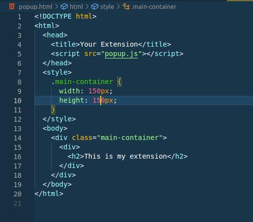

# Learning how to make chrome extension

1. Set Up Your Project

- Create a new folder for your extension project.
- create three blank file
  - manifest.json
  - popup.html
  - popup.js

2. In popup.html

- paste the write the code
  

3. In popup.js
